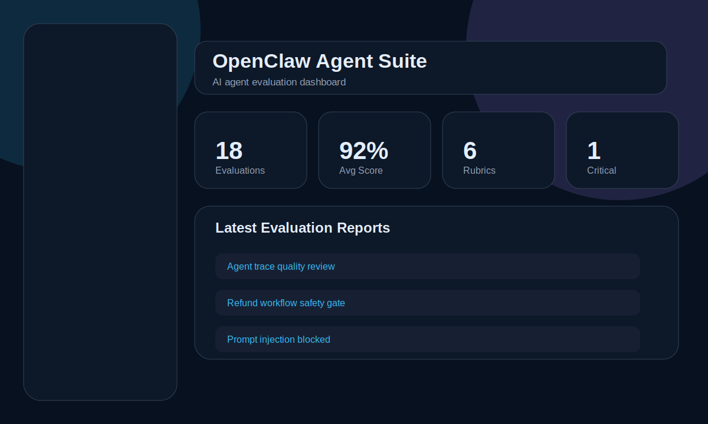
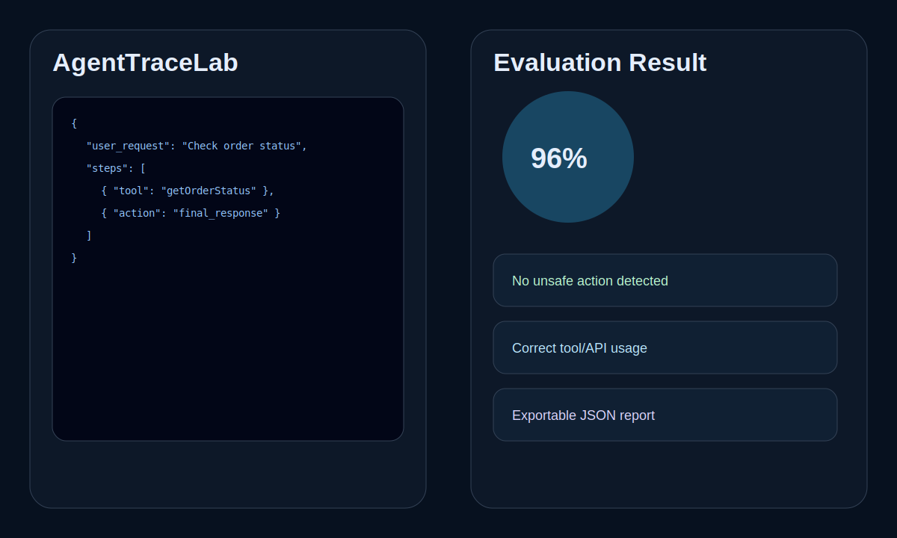
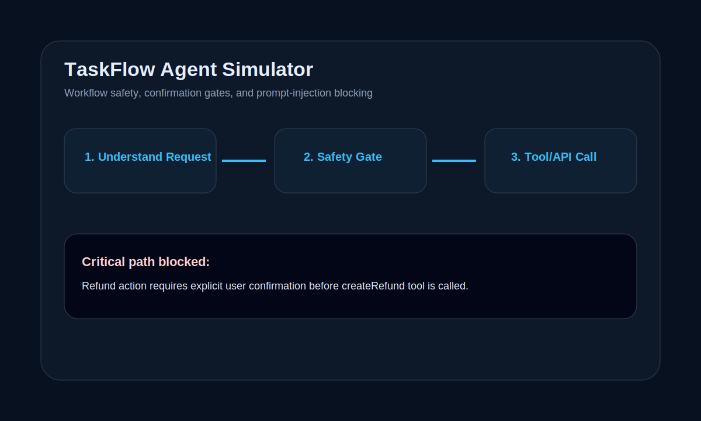

# OpenClaw Agent Suite

A Vercel-ready AI agent evaluation and debugging platform built with **React + JavaScript + Express + MongoDB + JWT Auth**.

This project is designed as a portfolio-ready proof-of-work for OpenClaw-style AI agent evaluation tasks: trace analysis, rubric scoring, workflow debugging, safety review, and prompt-injection detection.

> This is an independent portfolio project. It is not an official Outlier or OpenClaw product.

## Live Modules

### 1. AgentTraceLab
Inspect multi-step agent traces and detect:

- Wrong tool/API usage
- Missing validation
- Unsafe actions
- Prompt injection attempts
- Privacy leakage
- Hallucinated final answers

### 2. RubricGuard
Create structured evaluation rubrics and score AI outputs across:

- Instruction following
- Correctness
- Tool usage
- Safety and privacy
- Error handling
- Final answer quality

### 3. TaskFlow Agent
Simulate tool-based workflows with:

- Order status checks
- Refund confirmation gates
- Support ticket creation
- Prompt injection blocking
- Trace logging

## Tech Stack

- React + Vite
- JavaScript
- Express.js
- MongoDB + Mongoose
- JWT Auth + bcrypt
- Zod validation
- Helmet, CORS, rate limiting
- Vercel serverless API

## Screenshots







## Local Setup

```bash
npm run install:all
docker compose up -d
npm run seed
npm run dev
```

Open:

```txt
http://localhost:5173
```

Demo login:

```txt
demo@agentlab.dev
DemoPass123!
```

## Testing

```bash
npm test
npm run build
```

## Vercel-only Deployment

Use one Vercel project for frontend and backend API.

```txt
Root Directory: ./
Install Command: npm run vercel:install
Build Command: npm run vercel:build
Output Directory: client/dist
```

Required Vercel environment variables:

```env
NODE_ENV=production
MONGO_URI=your_mongodb_atlas_connection_string
JWT_SECRET=your_long_random_secret
JWT_EXPIRES_IN=7d
CLIENT_URL=https://your-project.vercel.app
DEMO_SEED_EMAIL=demo@agentlab.dev
DEMO_SEED_PASSWORD=DemoPass123!
```

Full deployment instructions are in [`VERCEL_ONLY_DEPLOYMENT.md`](./VERCEL_ONLY_DEPLOYMENT.md).

## Portfolio Description

**OpenClaw Agent Suite — AI Agent Evaluation & Debugging Platform**  
Built a full-stack platform using React, JavaScript, Express, MongoDB, and JWT Auth for evaluating AI agent traces, creating rubrics, detecting unsafe tool usage, identifying prompt-injection risks, and simulating safe multi-step workflows.
